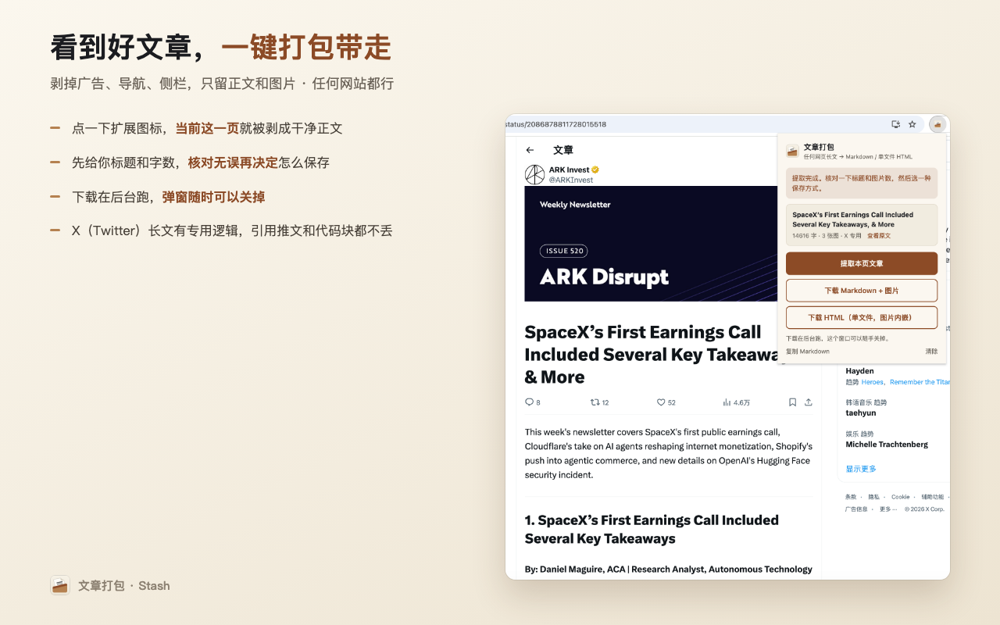
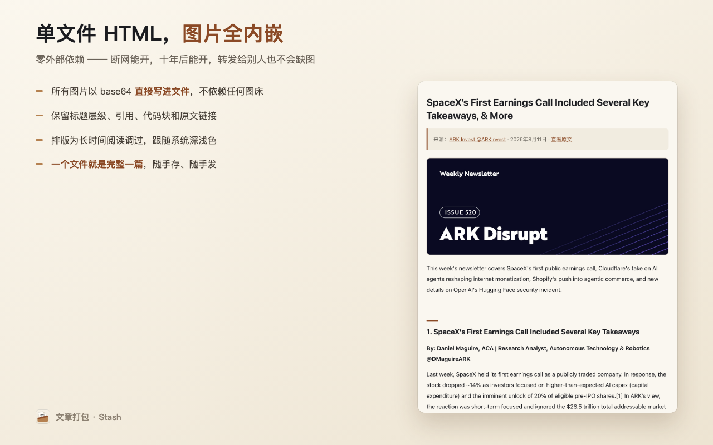
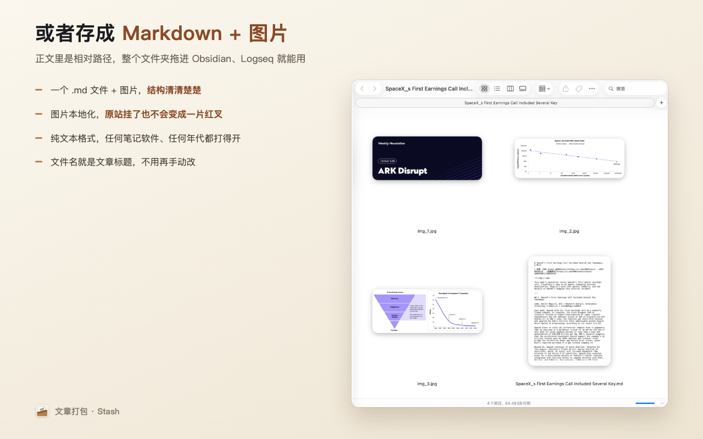

<div align="center">


# 文章打包 · Stash

**剥掉广告导航，把任何网页的正文连图打包下来，稍后读。**

输出 Markdown + 图片，或图片全内嵌的单文件 HTML。

</div>

---

## 这是什么

看到一篇好文章想留下来 —— 收藏夹里的链接会失效，「网页另存为」会带一堆广告和导航。

这个扩展只做一件事：**把正文剥出来，连图片一起打包成一个干净的文件，存到你自己电脑上。**

```
任意文章页 → 点扩展图标 → 提取 → 下载 Markdown 或 HTML
```

弹窗可以随时关掉，任务在后台跑完。

## 两种输出

| | 说明 |
|---|---|
| **Markdown + 图片** | 图片单独一个文件夹，正文里是相对路径。直接拖进 Obsidian / Logseq 就能用 |
| **单文件 HTML** | 所有图片以 base64 内嵌，**零外部依赖**。断网能开、十年后能开、发给别人不缺图 |

## 长什么样







## 适用范围

几乎所有以文章为主的网页：新闻、博客、维基百科、个人网站、论坛长贴。
正文识别用的是和浏览器「阅读模式」同一套算法（Mozilla **Readability**）。

**X（Twitter）长文有专用逻辑** —— 认得它的 DraftJS 编辑器结构、正文中嵌入的引用推文、
代码块，不会像通用算法那样抓得七零八落。

### 已知抓不好的情况

- 需要登录才显示正文的页面
- 正文靠 JavaScript 异步加载的页面
- 内容装在 iframe 里的页面

## 隐私

**这个扩展没有服务器。** 不收集任何数据、无统计无埋点、不向任何地方上传内容。
提取结果只存在浏览器会话里（关闭浏览器即清除），生成的文件只落到你自己的下载文件夹。

唯一离开你电脑的网络请求，是**直接去原网站下载图片** —— 和你在浏览器里打开那张图片没区别。

→ 完整说明见 [`PRIVACY.md`](PRIVACY.md)

## 安装

暂未上架 Chrome 网上应用店。开发者模式加载：

1. 下载本仓库，解压到一个**不会删掉的固定目录**
2. 打开 `chrome://extensions`，右上角开启「开发者模式」
3. 点「加载已解压的扩展程序」，选中 `extension/` 目录

> ⚠️ 目录删掉扩展就没了。

详细用法和常见问题见 [`extension/使用说明.md`](extension/使用说明.md)。

## 许可

本项目采用 **[MIT License](LICENSE)** —— 随便用、随便改、随便商用，
唯一要求是保留版权声明。

## 第三方组件

| 库 | 授权 | 用途 |
|---|---|---|
| [Readability.js](https://github.com/mozilla/readability) | Apache-2.0 | 把网页剥成干净正文 |
| [Turndown](https://github.com/mixmark-io/turndown) | MIT | HTML → Markdown |

→ 完整声明见 [`THIRD-PARTY-NOTICES.md`](THIRD-PARTY-NOTICES.md)

## 目录结构

```
extension/          插件本体（打包上架时只需要这个目录）
  vendor/           Readability.js + turndown.js（运行时依赖，不可删）
  icons/            图标源文件与构建脚本（build.sh --list 看全部方案）
store-assets/       商店截图（README 配图）
licenses/           第三方许可证全文
```

---
